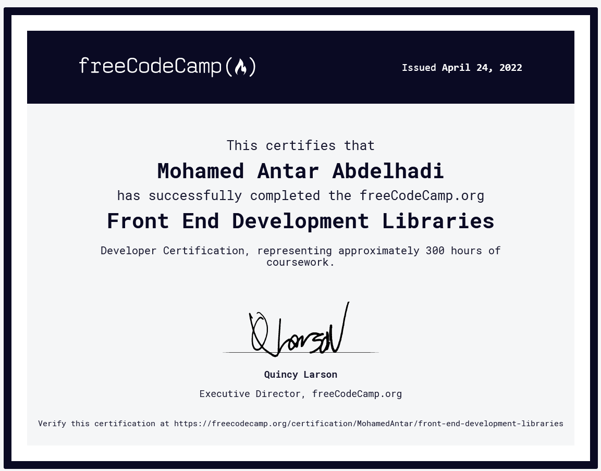

# 

# FreeCodeComp Front End Development Libraries [course link](https://www.freecodecamp.org/learn/front-end-development-libraries)

## Bootstrap
Bootstrap is a front end framework used to design responsive web pages and applications. It takes a mobile-first approach to web development, and includes pre-built CSS styles and classes, plus some JavaScript functionality.

In this course, you'll learn how to build responsive websites with Bootstrap, and use its included classes to style buttons, images, forms, navigation, and other common elements.

## jQuery
jQuery is one of the most widely used JavaScript libraries in the world.

In 2006 when it was released, all major browsers handled JavaScript slightly differently. jQuery simplified the process of writing client-side JavaScript, and also ensured that your code worked the same way in all browsers.

In this course, you'll learn how to use jQuery to select, remove, clone, and modify different elements on the page.

## SASS
Sass, or "Syntactically Awesome StyleSheets", is a language extension of CSS. It adds features that aren't available in basic CSS, which make it easier for you to simplify and maintain the style sheets for your projects.

In this Sass course, you'll learn how to store data in variables, nest CSS, create reusable styles with mixins, add logic and loops to your styles, and more.

## React
React is a popular JavaScript library for building reusable, component-driven user interfaces for web pages or applications.

React combines HTML with JavaScript functionality into its own markup language called JSX. React also makes it easy to manage the flow of data throughout the application.

In this course, you'll learn how to create different React components, manage data in the form of state props, use different lifecycle methods like `componentDidMount`, and much more.

## Redux
As applications grow in size and scope, managing shared data becomes much more difficult. Redux is defined as a "predictable state container for JavaScript apps" that helps ensure your apps work predictably, and are easier to test.

While you can use Redux with any view library, we introduce Redux here before combining it with React in the next set of courses.

In this course, you'll learn the fundamentals of Redux stores, actions, reducers and middleware to manage data throughout your application.

## React and Redux
React and Redux are often mentioned together, and with good reason. The developer who created Redux was a React developer who wanted to make it easier to share data across different components.

Now that you know how to manage the flow of shared data with Redux, it's time to combine that knowledge with React. In the React and Redux courses, you'll build a React component and learn how to manage state locally at the component level, and throughout the entire application with Redux.

# Front End Development Libraries Projects [link](https://www.freecodecamp.org/learn/front-end-development-libraries#front-end-development-libraries-projects)

## Build a Random Quote Machine [Project details](https://www.freecodecamp.org/learn/front-end-development-libraries/front-end-development-libraries-projects/build-a-random-quote-machine)

**[Solution](https://github.com/mohamedelfal/FreeCodeComp-Front-End-Development-Libraries/tree/main/1-Build-a-Random-Quote-Machine)**

## Build a Markdown Previewer [Project details](https://www.freecodecamp.org/learn/front-end-development-libraries/front-end-development-libraries-projects/build-a-markdown-previewer)

**[Solution](https://github.com/mohamedelfal/FreeCodeComp-Front-End-Development-Libraries/tree/main/2-Build-a-Markdown-Previewer)**

## Build a Drum Machine [Project details](https://www.freecodecamp.org/learn/front-end-development-libraries/front-end-development-libraries-projects/build-a-drum-machine)

**[Solution](https://github.com/mohamedelfal/FreeCodeComp-Front-End-Development-Libraries/tree/main/3-Build-a-Drum-Machine)**

## Build a JavaScript Calculator [Project details](https://www.freecodecamp.org/learn/front-end-development-libraries/front-end-development-libraries-projects/build-a-javascript-calculator)

**[Solution](https://github.com/mohamedelfal/FreeCodeComp-Front-End-Development-Libraries/tree/main/4-Build-a-JavaScript-Calculator)**

## Build a 25 + 5 Clock [Project details](https://www.freecodecamp.org/learn/front-end-development-libraries/front-end-development-libraries-projects/build-a-25--5-clock)

**[Solution](https://github.com/mohamedelfal/FreeCodeComp-Front-End-Development-Libraries/tree/main/5-Build-a-25-5-Clock)**

#  [Certification](https://www.freecodecamp.org/certification/MohamedAntar/front-end-development-libraries)

